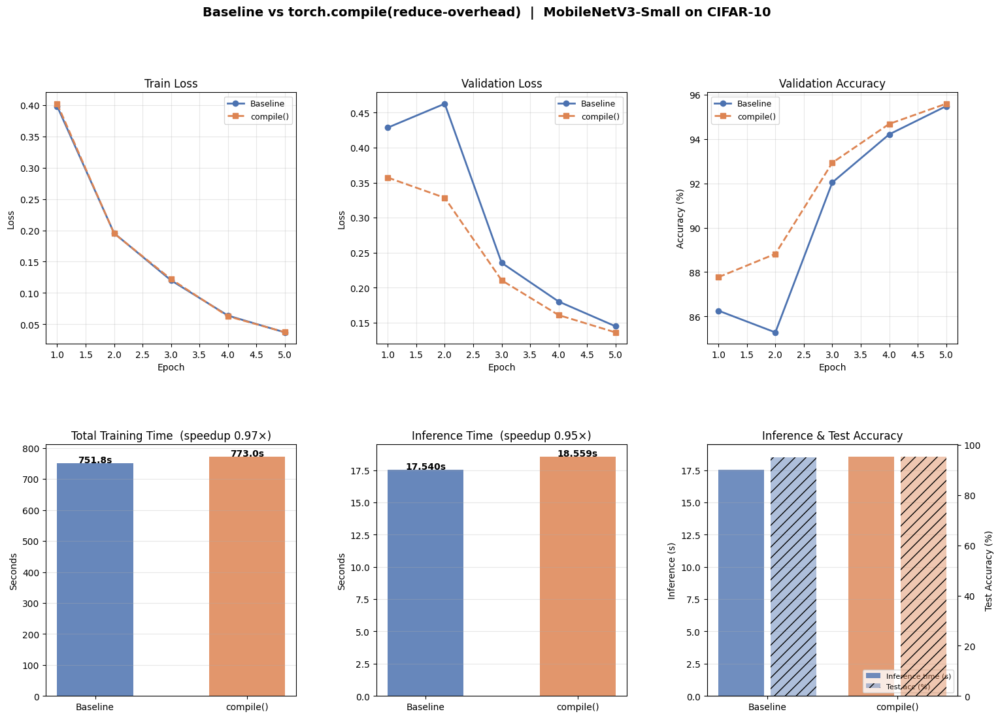

# CIFAR-10 Classification Benchmark: Baseline vs `torch.compile()`

Fine-tuning **MobileNetV3-Small** (ImageNet pretrained) on CIFAR-10 using **PyTorch Lightning**,
with a side-by-side comparison of standard training against `torch.compile(mode='reduce-overhead')`.

The experiment runs two identical training loops — same model, same hyperparameters, same seed —
differing only in whether the backbone is wrapped with `torch.compile()` before training.
Both runs are evaluated on the same held-out test set to isolate the effect of compilation
on wall-clock training time, inference latency, and final accuracy.

Hardware was CPU-only. As a result, `compile()` showed no speedup — the `reduce-overhead` mode
targets CUDA graph optimisation and per-kernel launch latency, neither of which applies on CPU.
The JIT compilation cost during epoch 1 was not amortised over the 5-epoch run, making the
compiled run measurably slower overall. Accuracy remained virtually identical across both runs,
confirming that `torch.compile()` is a pure runtime optimisation with no effect on model math.
